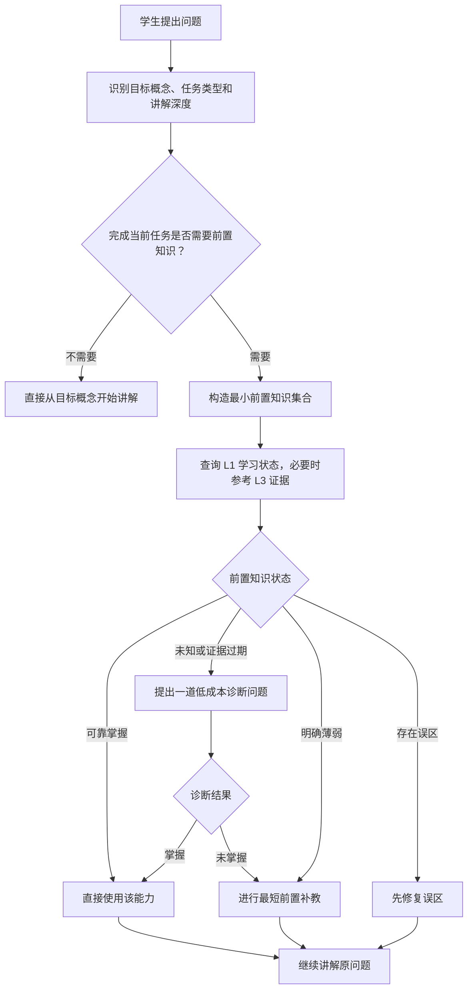

# 学习状态引擎设计

状态：Draft

目标版本：L1 Learner State v2

适用范围：`apps/inno-agent/src/memory/learner/`、学习者上下文注入、学习者画像 API 与前端学习面板

实现进度（`codex/learner-state-prerequisite-gate`）：首个后端纵向切片已实现，包括结构化证据、紧凑状态快照回写、动态 Context Pack、L2 显式前置关系、教学入口判断和 Agent 工具。前端状态面板、完整历史投影迁移、前置关系编辑界面及真实数据校准仍未实现。

## 1. 背景

Inno Agent 当前包含三层记忆：

- L1 学习者画像：目标、概念掌握度、误区、偏好。
- L2 Wiki：结构化知识、材料与学习产物。
- L3 会话记忆：跨会话召回过去的交流片段。

这三层首先解决的是“Agent 如何记住用户和上下文”。它们尚未完整解决另一个不同的问题：**学习者在当前时刻还能否独立回忆和迁移所学内容**。

当前 L1 已经具备 `mastery`、`confidence`、`stability`、`last_practiced_at` 和 `review_due_at` 等字段，但状态更新仍主要采用增量规则：

- `concept_explained` 默认增加掌握度；
- `exercise_attempt` 缺少正确性、提示程度、间隔时间和迁移难度等结构化信息；
- 掌握度主要在事件写入时变化，之后不会随时间改变；
- 复习时间根据掌握度固定为 1、3、7 天；
- 模型可以直接提交 `mastery_delta`，缺少统一、可校准的状态转移规则。

因此，系统可能把“讲过”“看过”“在同一对话里立即答对”误认为稳定掌握，并随着事件累积持续高估学习者状态。

## 2. 核心判断

本设计不增加第四层记忆，而是在现有三层之上加入一个派生的学习状态引擎。

需要明确区分三类数据：

1. **Agent 记忆**：过去发生过什么，由 L2/L3 保存和召回。
2. **学习证据**：学习者做了什么、结果如何，使用追加式事件保存。
3. **当前学习状态**：根据证据和时间推导的估计，可上升、下降、过期和重建。

设计原则是：

> 证据可以只增不减，学习状态必须可升可降；系统讲过不等于学习者学会。

## 3. 目标与非目标

### 3.1 目标

- 对“接触、提示后回答、独立提取、延迟提取、迁移应用”赋予不同证据强度。
- 在没有新写入的情况下，根据时间计算当前可提取概率。
- 区分“从未学会”“刚学会但脆弱”“学会后遗忘”“存在稳定误区”。
- 从追加式证据确定性重建当前状态，支持算法升级和审计。
- 生成可解释的复习队列，而不是只保存一个固定日期。
- 为 Agent 提供简短、可执行的教学策略，而不是注入大量历史记录。
- 保持现有 L1 API 和前端在迁移期可用。

### 3.2 非目标

- 第一版不声称精确模拟人的认知过程。
- 第一版不自动生成完整课程或跨学科知识图谱。
- 第一版不使用模型输出直接覆盖学习状态。
- 第一版不把 L2 文档数量或 L3 会话长度当作掌握证据。
- 第一版不要求后台定时任务持续写入“衰减后的掌握度”。

## 4. 总体架构

```text
教学、练习或诊断
        │
        ▼
原始学习事件 events.jsonl（不可变证据账本）
        │ 规范化
        ▼
LearningEvidence（统一证据模型）
        │ 状态转移 + 时间函数
        ▼
LearnerStateProjection（可重建的派生状态）
        │
        ├── Context Pack：下一轮教学策略
        ├── Review Queue：待复习与待诊断概念
        ├── Learner UI：稳定、脆弱、到期、误区
        └── Calibration：预测与实际表现对比
```

### 4.1 数据职责

| 数据 | 写入方式 | 是否衰减 | 是否可重建 | 作用 |
|---|---|---:|---:|---|
| L2 Wiki | 文档写入 | 否 | 否 | 保存知识与学习产物 |
| L3 Session | 会话追加 | 否 | 可重新索引 | 保存情境和交流历史 |
| Learning Event | 事件追加 | 否 | 原始事实 | 保存学习证据 |
| Learner State | 投影更新 | 是，读取时计算 | 是 | 估计当前学习状态 |

L2/L3 可以帮助 Agent 生成问题和解释，但不能直接提高学习者掌握度。

## 5. 学习证据模型

### 5.1 证据类型

建议在兼容现有 `LearningEvent` 的基础上增加规范化证据对象：

```ts
type EvidenceKind =
  | "exposure"
  | "recognition"
  | "guided_recall"
  | "free_recall"
  | "application"
  | "transfer"
  | "self_report"
  | "manual_override";

type EvidenceResult = "correct" | "partial" | "incorrect" | "unknown";

interface LearningEvidence {
  evidence_id: string;
  event_id: string;
  learner_id: string;
  concept_id: string;
  occurred_at: string;
  kind: EvidenceKind;
  result: EvidenceResult;
  score?: number;                // 0-1；比三值结果更细时使用
  hint_level: 0 | 1 | 2 | 3;    // 无提示、轻提示、强提示、答案已揭示
  delay_seconds?: number;        // 距离最近一次相关接触/提取
  transfer_distance?: number;    // 0-1；题面变化和情境迁移程度
  learner_confidence?: number;   // 学习者作答前的自信度
  evaluator: "deterministic" | "rubric" | "model" | "teacher" | "self";
  evaluator_confidence: number;  // 对本条评分可靠性的估计
  session_id?: string;
  misconception_id?: string;     // 仅在验证一条已知误区时显式关联
  metadata?: Record<string, unknown>;
}
```

### 5.2 证据强度

第一版使用透明的确定性权重，而不是让模型直接输出掌握度增量。

建议初始权重：

| 证据 | 基础权重 | 说明 |
|---|---:|---|
| `exposure` | 0.00 | 看过或听过不能证明掌握 |
| `self_report` | 0.10 | 只用于形成先验，不作为强证据 |
| `recognition` | 0.25 | 选择或识别正确 |
| `guided_recall` | 0.45 | 在提示下完成提取 |
| `free_recall` | 0.75 | 无提示独立回答 |
| `application` | 0.85 | 在题目中正确应用 |
| `transfer` | 1.00 | 在新情境中成功迁移 |

提示系数：

| 提示级别 | 系数 |
|---|---:|
| 0 无提示 | 1.00 |
| 1 轻提示 | 0.80 |
| 2 强提示 | 0.50 |
| 3 已给答案 | 0.10 |

单条证据可靠性权重：

```text
w = kind_weight
  × hint_weight
  × evaluator_confidence
  × spacing_weight
```

`spacing_weight` 用于让延迟后的成功提取比刚讲完的立即复述更有价值。第一版将其限制在 `0.75-1.25`，避免单次事件造成过大跳变。具体参数属于可校准配置，不写死在类型中。

### 5.3 不允许作为掌握证据的行为

- Assistant 完成了一次讲解。
- Agent 在 L2 写入了一篇文档。
- 会话中出现过某个概念名称。
- 学习者仅表示“懂了”“应该会了”。
- 模型根据语气猜测学习者已经掌握。

这些行为可以产生 `exposure` 或 `self_report`，但不能直接提高稳定度。

误区修复必须显式关联 `misconception_id`。概念级答对只能更新知识状态，不能自动清除同概念下所有误区；一条可靠、低提示的修复检查先把误区从 `active` 推进到 `repairing`，后续独立迁移证据才能支持标记为 `resolved`。

## 6. 学习状态模型

### 6.1 KnowledgeState v2

保留现有字段用于迁移，并补充能表达遗忘和证据质量的字段：

```ts
interface KnowledgeStateV2 {
  concept_id: string;
  concept_name: string;
  domain: string;

  // 长期能力估计，不随时间直接衰减，由证据更新
  mastery: number;                 // 0-1
  estimate_confidence: number;     // 系统对 mastery 估计的置信度

  // 记忆动力学
  stability_days: number;          // 当前记忆保持尺度
  difficulty: number;              // 0-1
  last_evidence_at?: string;
  last_successful_retrieval_at?: string;
  next_review_at?: string;

  // 聚合统计
  exposure_count: number;
  retrieval_count: number;
  lapse_count: number;
  successful_transfer_count: number;

  // 解释与审计
  evidence_ids: string[];
  diagnosis: string;
  next_actions: string[];
  state_label: "unknown" | "learning" | "fragile" | "review_due" | "stable" | "misconception";
  model_version: string;
}
```

当前 `confidence` 含义不明确。v2 将它拆为：

- `estimate_confidence`：系统对状态估计的可信程度；
- `learner_confidence`：保存在单次证据上，表示学习者自信程度。

### 6.2 当前可提取概率

`mastery` 表示长期能力估计；`retrievability` 表示当前时刻能否提取，读取时动态计算，不持续写回文件。

第一版采用可解释的衰减函数：

```text
R(t) = 0.9 ^ (elapsed_days / stability_days)
```

含义：经过 `stability_days` 天，预计可提取概率下降到约 90%。这是一个初始模型，后续根据真实预测误差校准。

当没有成功提取记录时，不展示虚假的精确概率，而是标记为 `unknown` 或 `learning`。

### 6.3 掌握度更新

对具有结果的证据，使用收敛式更新，而不是直接相加：

```text
observed = correct ? 1 : partial ? 0.5 : incorrect ? 0 : no-op
mastery' = clamp(mastery + learning_rate × w × (observed - mastery), 0, 1)
```

这样：

- 答对会提高掌握度，但越接近 1 增长越慢；
- 答错会降低掌握度；
- 弱证据只产生小幅变化；
- `exposure` 不改变掌握度；
- 重放同一事件不会重复更新。

第一版 `learning_rate` 建议为 `0.35`，作为可配置参数进入 `model_version`。

### 6.4 稳定度更新

- 延迟后、无提示的正确提取显著增加 `stability_days`。
- 立即复述或提示后答对只小幅增加稳定度。
- 答错产生 `lapse`，降低稳定度，但不把历史学习清零。
- 成功迁移同时提升掌握度和稳定度。
- 单纯讲解不改变稳定度。

初始规则可以保持简单：

```text
成功：S' = clamp(S × (1 + 0.6w + 0.3 × max(0, 1-R)), 0.25, 365)
失败：S' = clamp(S × (0.8 - 0.4w), 0.25, 365)
```

参数必须通过测试固定，并在后续版本中根据校准数据调整。任何参数变化都提升 `model_version`，触发投影重建。

### 6.5 状态标签

状态标签是可解释的 UI/策略输出，不是另一套独立真相：

- `unknown`：没有可靠提取证据。
- `learning`：有接触或低质量证据，尚未独立提取。
- `fragile`：近期能答对，但稳定度低或只在提示下成功。
- `review_due`：预测可提取概率低于目标阈值。
- `stable`：多次延迟提取成功，且至少有一次应用或迁移。
- `misconception`：存在高置信度的活跃误区证据。

禁止仅凭单次立即作答进入 `stable`。

## 7. 复习队列与教学策略

### 7.1 复习队列

复习队列读取当前时间动态计算，不需要 cron 定时降低掌握度。

建议优先级：

```text
priority = goal_priority
         × due_urgency
         × (1 - retrievability)
         × uncertainty_bonus
         × misconception_bonus
```

队列应区分：

- `diagnose`：状态未知，先用一道低成本问题获取证据；
- `retrieve`：曾经学会但到期，优先主动提取；
- `repair`：误区仍活跃，使用对比、反例或表征转换；
- `teach`：长期能力低，不应只安排重复测试；
- `transfer`：基础已稳定，需要验证新情境应用。

### 7.2 Agent 行为规则

Context Pack 不只告诉 Agent “掌握度 0.63”，还应提供策略：

```text
- concept: physics.force_analysis
  state: review_due
  retrievability: 0.58
  evidence: 上次为无提示正确，距今 9 天
  action: 先给一道不提示的受力分析小题；作答前不要重新讲解
```

为了避免产品变成“用户问什么都先考试”，引入交互约束：

- 普通任务模式下，每个新主题最多插入一个低成本诊断。
- 用户明确要求直接答案、处于紧急任务或关闭诊断时，不强制提问。
- 诊断失败后先教学，不连续追问制造挫败。
- 复习推荐可跳过、稍后处理或永久关闭。

## 8. 前置知识解析器（Prerequisite Resolver）

学习状态引擎回答“学习者当前会不会”；前置知识解析器回答“为了完成当前任务，哪些能力必须先会，以及现在应该直接使用、诊断还是补教”。两者职责不同，但必须在教学决策阶段协同。

### 8.1 教学入口门控

前置知识解析应发生在模型正式讲解学习问题之前，作为一次轻量的 `Teaching Entry Gate`。它不要求每次都提问，而是先判断本题是否真的依赖前置知识。



门控流程分为六步：

1. 判断用户是在学习、理解或解决问题，还是只要求执行一次任务或直接给出结果；
2. 识别本次问题的目标概念、题型和要求达到的深度；
3. 判断完成当前任务是否存在必要前置知识；
4. 若不存在，则直接从目标概念开始讲解，不制造无意义的追问；
5. 若存在，则只检查最关键的最小前置集合，并依据学习状态选择直接使用、诊断、补教或纠错；
6. 诊断或补教完成后恢复原问题的条件、步骤和进度。

“概念非常基础”在这里表示：它已达到本次教学的原子概念边界，没有值得继续追溯的学科前置知识。此时系统直接从该概念开始教学，而不是继续追问更基础的日常认知。它不表示系统已经证明学生掌握这个概念。

例如，学生问“速度是什么意思”时，可以从位移随时间变化直接讲起，不应继续诊断学生是否理解时间或除法；学生问“斜面上物体的加速度怎么求”时，则应检查受力分析和力的分解是否满足当前题目的要求。

### 8.2 核心原则

- 未知不等于已掌握，也不等于未掌握；未知状态优先触发低成本诊断。
- 只处理完成当前任务所需的最小前置知识集合，禁止无限向上追溯整个学科体系。
- 前置要求是任务相关的：同一概念在入门理解、常规应用和竞赛证明中需要的掌握水平不同。
- 诊断或补教结束后必须回到原始问题，不能让前置内容取代用户的主要目标。
- 用户明确要求直接答案、处于紧急任务模式或关闭诊断时，可以跳过主动诊断。
- L2 中存在概念链接不能证明学习者掌握该概念；L3 中讨论过该概念也只能作为候选证据。

### 8.3 前置关系模型

普通 Wiki 链接只表示“相关”，不足以表达教学依赖。建议在 L2 增加显式关系：

```ts
type PrerequisiteRelation = "required" | "supporting";
type PrerequisiteSource = "curated" | "teacher" | "imported" | "model_inferred";

interface PrerequisiteEdge {
  target_concept_id: string;
  prerequisite_concept_id: string;
  relation: PrerequisiteRelation;
  required_level: number;       // 当前任务要求的最低长期掌握度，0-1
  importance: number;           // 对完成目标的必要程度，0-1
  source: PrerequisiteSource;
  source_confidence: number;    // 对关系本身的可信度，0-1
  rationale: string;            // 为什么它是前置知识
  scope?: string;               // 适用题型、课程或难度范围
  evidence_refs?: string[];
}
```

来源优先级建议为：教师或课程显式标注、经过审核的概念目录、导入材料中的明确关系、模型推断。模型推断关系默认低置信，未确认前不能作为阻断用户任务的唯一依据。

### 8.4 运行时评估

解析器将前置关系与 L1 当前状态组合，生成面向本次任务的判断：

```ts
type PrerequisiteStatus = "satisfied" | "uncertain" | "missing" | "misconception";

interface PrerequisiteAssessment {
  target_concept_id: string;
  prerequisite_concept_id: string;
  status: PrerequisiteStatus;
  required_level: number;
  estimated_mastery?: number;
  retrievability?: number;
  estimate_confidence: number;
  reason: string;
  evidence_ids: string[];
  recommended_action: "use" | "diagnose" | "teach" | "repair";
}
```

初始判定规则：

- `satisfied`：掌握度达到任务要求，且当前可提取概率与估计置信度均超过阈值；
- `uncertain`：没有可靠证据，或证据太旧、相互冲突；
- `missing`：可靠证据显示未达到当前任务要求；
- `misconception`：存在与本次任务相关的高置信活跃误区。

### 8.5 最小前置包

解析器不把所有祖先概念都塞进 Context Pack，而是构造 `Minimum Prerequisite Envelope`：

1. 从目标概念查询显式前置边；
2. 根据当前任务的难度和范围过滤关系；
3. 查询 L1 的当前学习状态；
4. 删除已经稳定满足、且无需本轮提醒的前置项；
5. 按 `importance × knowledge_gap × uncertainty` 排序；
6. 只保留会实质影响当前任务的少量关键项。

第一版建议默认最大追溯深度为 2、主动处理最多 3 个前置概念。若多个前置概念同时缺失，优先选择最靠近目标且能解锁最多后续步骤的概念。环路、重复边和低置信模型推断必须被检测并跳过。

### 8.6 诊断与即时补教

对 `uncertain` 状态，优先选择一道低摩擦、高信息量的诊断：

- 只测试当前解题真正会用到的能力；
- 尽量在一次回答内区分“会、不会、存在误区”；
- 优先让学生实际完成一个最小任务，而不是只问“你会不会”；
- 不在题干中提前泄露即将测试的关键步骤；
- 诊断结果写入结构化学习证据，而不是直接修改 mastery；
- 普通模式下，一个新主题最多主动插入一次诊断。

诊断后执行：

```text
satisfied    → 直接把前置知识作为可用能力，继续原任务
uncertain    → 一道低成本诊断；仍不确定时采用带保护的解释
missing      → 给出最短可用的前置桥接讲解，再做一次小验证
misconception → 使用反例、对比或表征转换修复，再回到原任务
```

补教不是完整重上一个章节，而是 `just-in-time remediation`：只补足本题所需部分，并明确告诉学习者为什么暂时转入这个前置概念。完成后恢复原题的步骤、已知条件和进度。

诊断结果必须写回不可变学习事件，形成带时间、题型、提示程度和作答结果的证据。以后遇到相似任务时，学习状态引擎根据证据强度、任务要求和时间间隔决定能否直接使用，而不是永久标记为“已经掌握”，也不能在每次对话中重复询问同一个前置问题。

### 8.7 三层记忆中的职责

| 模块 | 回答的问题 | 在前置知识解析中的职责 |
|---|---|---|
| L2 Wiki / 概念图 | “哪些知识相互依赖？” | 保存前置边、定义、例题和桥接材料 |
| L1 学习状态 | “这个学习者现在会不会？” | 提供 mastery、retrievability、误区和估计置信度 |
| L3 会话记忆 | “过去在什么情境下讨论或表现过？” | 提供可追溯候选证据和历史语境，不直接判定掌握 |
| Prerequisite Resolver | “这一次应该怎么教？” | 合并任务要求和三层信息，输出诊断或补教动作 |

解析结果应进入 Context Pack，例如：

```text
- target: physics.inclined_plane_acceleration
- prerequisite: physics.force_decomposition
  status: uncertain
  reason: 曾讲解过，但没有无提示应用证据
  action: 先让学生画出重力沿斜面方向的分量；不要先给公式
```

解析结果是当前任务的临时决策，不应作为第四层长期记忆。前置关系保存到 L2，诊断结果保存为学习证据，当前判断可以随任务和时间重新计算。

## 9. 存储与重建

### 9.1 事件账本

继续使用 `events.jsonl` 作为不可变账本，但增加：

- `schema_version`；
- 规范化证据字段；
- `dedupe_key`，防止工具重试重复写入；
- `source` 和评分可靠性；
- 手动修改使用 `manual_override` 事件，而不是静默覆盖画像。

### 9.2 派生投影

`profile.json` 逐步变为可重建缓存，并增加元数据：

```ts
interface LearnerStateProjectionMeta {
  schema_version: 2;
  model_version: string;
  projected_at: string;
  last_event_id?: string;
  last_event_offset?: number;
}
```

正常写入时只处理新增事件；以下情况全量重建：

- `model_version` 变化；
- 投影文件缺失或损坏；
- 管理员或用户主动请求重建；
- 事件账本发生修复。

重建必须从空的派生状态开始，不能在当前画像上重复折叠。用户声明的目标、偏好和手动修正也应来自事件，因此不会丢失。

### 9.3 时间衰减

衰减采用“读取时计算”：

- 不每天修改 `profile.json`；
- API、Context Pack 和 Review Queue 接受统一的 `asOf` 时间；
- 测试使用注入时钟，禁止直接依赖不可控的 `Date.now()`；
- 相同事件集合、模型版本和 `asOf` 必须产生相同结果。

## 10. 与现有代码的集成

### 10.1 后端模块

建议在 `apps/inno-agent/src/memory/learner/` 增加：

- `evidence.ts`：事件到规范化证据的转换和校验；
- `state-engine.ts`：状态转移、衰减、标签计算；
- `projection-store.ts`：增量投影、版本和重建；
- `review-policy.ts`：复习队列和教学动作选择；
- `teaching-entry-gate.ts`：识别学习任务及目标深度，并编排直接讲解、前置诊断和返回原题；
- `prerequisite-resolver.ts`：构造最小前置包并选择诊断、补教或直接使用；
- `prerequisite-store.ts`：读取、校验和查询 L2 显式前置关系；
- `clock.ts`：生产时钟与测试时钟接口。

现有模块调整：

- `types.ts`：增加 v2 schema，保留 v1 读取兼容；
- `profile-store.ts`：证据写入成功后更新投影；
- `auto-profile.ts`：停止对 `concept_explained` 自动增加掌握度，逐步由 state engine 替代；
- `profile-updater.ts`：直接 patch 掌握度改为写入 `manual_override` 事件；
- `context-pack.ts`：注入动态 `retrievability`、状态标签、证据摘要、建议动作和与当前任务相关的关键前置判断，避免全量展开知识图谱；
- `learner-tools.ts`：增加结构化 `record_learning_evidence`，限制模型直接提交 `mastery_delta`；
- `rebuild-profile.ts`：从空投影确定性重放，而不是在现有画像上合并。

### 10.2 API

保留现有 `/api/learner/profile`，新增：

- `POST /api/learner/evidence`：记录一条经过校验的学习证据；
- `GET /api/learner/state?asOf=...`：返回动态学习状态；
- `GET /api/learner/review-queue?limit=...`：返回带原因的复习队列；
- `GET /api/learner/concepts/:id/evidence`：查看概念证据时间线；
- `GET /api/learner/prerequisites/:id?scope=...`：查看目标概念的显式前置关系；
- `POST /api/learner/prerequisite-assessment`：按当前任务生成最小前置包；
- `POST /api/learner/rebuild`：按当前模型版本重建投影。

写 API 必须返回更新后的投影版本和受影响概念，便于前端增量刷新。

### 10.3 前端

学习者面板从单一“掌握度百分比”调整为：

- 当前状态：未知、学习中、脆弱、到期、稳定、误区；
- 长期掌握度与当前可提取概率分别展示；
- “为什么这样判断”的最近证据；
- 下一步建议和预计复习时间；
- 用户纠正入口，纠正操作生成可审计事件；
- 单独的“待复习”和“需要重新教学”列表。
- 在教学过程中说明“为什么先补这一小段”，并允许跳过或标记为已经掌握。

避免把随时间下降的 `retrievability` 表现为惩罚性分数。文案应表达“需要唤醒”而不是“掌握度退步”。

## 11. 兼容与迁移

### 11.1 旧事件转换

| 旧事件 | v2 解释 |
|---|---|
| `concept_explained` | `exposure`，不增加 mastery/stability |
| `exercise_attempt` 且有结果 | 转为对应 recall/application 证据 |
| `exercise_attempt` 但无结果 | 保留记录，不形成强掌握证据 |
| `self_assessed` | `self_report`，低权重先验 |
| `milestone_reached` | 只有附带可验证结果时才转为强证据 |
| `mastery_delta` | 标记为 legacy inference，不再作为新写入格式 |

### 11.2 旧 KnowledgeState

迁移时：

- 旧 `mastery` 作为先验保留；
- 旧 `confidence` 上限限制为较低的估计置信度，直到出现新提取证据；
- 旧 `stability` 映射为保守的初始 `stability_days`；
- 所有仅由讲解产生的“已掌握”状态降为 `learning` 或 `unknown`；
- 不删除旧字段，前端迁移完成后再进入弃用周期。

迁移脚本必须支持 dry-run、备份和幂等执行。

## 12. 测试策略

### 12.1 状态引擎单元测试

- 讲解事件不会提高 mastery 或 stability。
- 无提示延迟成功比立即、提示后成功增加更多稳定度。
- 独立答错会降低 mastery 并增加 lapse。
- 经过时间后 retrievability 下降，但事件和长期历史不消失。
- 同一事件重复处理不会重复更新。
- 相同事件、模型版本和 `asOf` 得到相同结果。
- 一次成功不能直接进入 `stable`。
- 活跃高置信误区优先进入 `repair`。

### 12.2 投影与迁移测试

- 增量投影和全量重建结果一致。
- v1 profile/events 可以迁移并继续使用现有 API。
- 投影损坏时可以从事件账本恢复。
- `model_version` 变化会触发安全重建。
- 手动修正被保存为事件，重建后仍存在。

### 12.3 前置知识解析测试

- 当前目标达到原子概念边界时直接教学，不继续追溯或提问。
- 同一目标在不同题型和讲解深度下得到不同的最小前置包。
- 未知前置状态生成 `diagnose`，而不是假定掌握或直接判定不会。
- 已稳定满足的前置知识不会打断当前任务。
- 缺失前置知识只触发最短桥接讲解，并在完成后恢复原任务。
- 活跃误区优先于普通薄弱项进入 `repair`。
- 最大深度、最大概念数、环路和低置信边得到正确限制。
- 相同目标、任务范围、状态版本和 `asOf` 产生相同前置判断。
- 用户跳过诊断后，本轮不重复追问。
- 诊断结果形成结构化证据，后续相似任务不会无条件重复同一诊断。

### 12.4 集成测试

- Agent 讲解结束后不会自动把概念标记为掌握。
- Agent 在适当模式下先进行一次低成本诊断。
- 用户跳过诊断时不会被反复追问。
- 当前题目依赖未知前置知识时，Agent 先做一次低成本诊断；诊断失败后补教并回到原题。
- Review Queue 的原因与 Context Pack 一致。
- 前端能够解释状态来源并展示证据时间线。

## 13. 评估指标

项目不应以“记录了多少知识状态”作为成功指标。建议关注：

- 预测校准：预测可提取概率与实际正确率的差异；
- 延迟提取成功率；
- 无提示正确率；
- 迁移成功率；
- “系统判断已稳定但随后答错”的比例；
- 每次有效稳定度提升所需的练习次数；
- 诊断/复习的跳过率和用户打扰反馈；
- 误区修复后再次出现的比例。
- 前置诊断命中率：被判断为不确定的前置概念中，诊断实际发现缺失或误区的比例；
- 无需诊断打断率：稳定前置知识被系统错误打断的比例；
- 前置补教后回到原任务并完成的比例。

第一版以匿名、本地聚合方式计算；不默认上传学习内容或原始答案。

## 14. 分阶段实施

### Phase 0：设计与基线

- 固化本设计中的术语、证据 schema 和状态标签。
- 固化前置关系 schema、关系来源优先级和最小前置包边界。
- 为当前 L1 行为补基线测试。
- 记录现有事件样本，建立迁移 fixture。

### Phase 1：影子状态引擎

- 新增 evidence normalization 和 state engine。
- 在 feature flag 后运行 v2 投影，但不改变 Agent 行为和 UI。
- 对比 v1/v2 输出，确认迁移和性能。

### Phase 2：Context Pack 与 Review Queue

- 注入状态标签、当前可提取概率和建议动作。
- 增加 review queue API。
- 停止 `concept_explained` 自动增加掌握度。
- 先以只读影子模式生成前置判断，不改变 Agent 回答。

### Phase 3：诊断与证据采集

- 增加 `record_learning_evidence` 工具。
- 引入诊断、提示级别和迁移任务。
- 启用最小前置包、一次诊断和即时补教闭环。
- 增加交互频率限制与用户开关。

### Phase 4：前端与校准

- 展示动态状态、证据时间线和复习队列。
- 收集本地预测误差，逐步校准参数。
- 完成旧字段和旧工具的弃用计划。

## 15. 验收标准

第一阶段完整上线至少满足：

- Assistant 的讲解本身不能提高学习者掌握度。
- 状态在无新写入时能够随 `asOf` 变化。
- 答对、答错、提示和迁移产生方向正确且强度不同的更新。
- 投影可从事件账本确定性重建。
- 现有用户数据可以无损迁移和回滚。
- 用户可以查看系统为何判断其“脆弱”或“到期”。
- 用户可以纠正错误判断或关闭主动诊断。
- 未知前置知识不会被默认视为已掌握；系统能在一次低成本诊断后选择继续、补教或纠错。
- 当前任务没有必要前置知识时，系统直接讲解，不为了收集画像而打断学生。
- 前置补教不会无限追溯，并且能够恢复原始问题的上下文和进度。
- 100 个概念的状态计算和复习队列生成在普通开发机上保持交互级延迟。

## 16. 待确认决策

实施前需要确认：

1. 概念 ID 由 Agent 自由生成，还是建立受控概念目录和别名表？
2. 默认在哪些对话模式启用主动诊断？
3. 学习者手动修改 mastery 时，是绝对覆盖还是生成高权重先验证据？
4. 第一版是否允许模型评分开放题，还是只处理可确定评分的练习？
5. Review Queue 仅在用户打开面板时展示，还是允许在对话中主动提醒？
6. 是否将现有 `stability` 直接迁移为天数，还是保留一个版本周期的双字段？
7. 第一版前置关系由教师/课程预置多少，模型推断关系是否允许自动持久化？
8. 默认最大诊断次数、追溯深度和最小前置包大小分别是多少？

本文建议的默认答案是：受控别名、仅学习模式主动诊断、手动修改生成事件、模型评分必须带 rubric 和低置信、对话提醒可关闭、稳定度双字段迁移一个版本周期；前置关系以教师/课程预置为主，模型推断只作为低置信候选；默认每个新主题最多一次主动诊断、追溯深度 2、主动处理最多 3 个前置概念。
